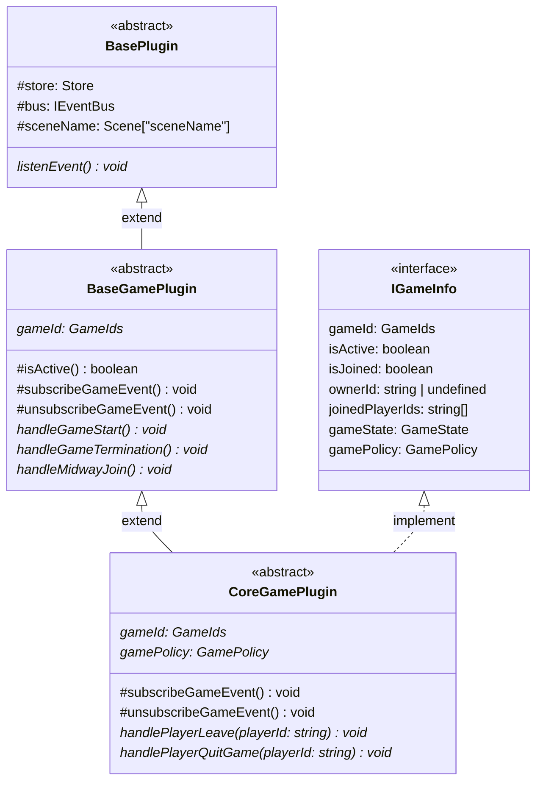

# gamePluginのクラス図

```mermaid
classDiagram
    BasePlugin <|-- BaseGamePlugin : extend
    BaseGamePlugin <|-- CoreGamePlugin : extend
    IGameInfo <|.. CoreGamePlugin : implement

    class BasePlugin {
        <<abstract>>
        #store: Store<Scene>
        #bus: IEventBus<Scene>
        #sceneName: Scene["sceneName"]

        listenEvent() void *
    }
    
    class IGameInfo {
        <<interface>>
        gameId: GameIds
        isActive: boolean
        isJoined: boolean
        ownerId: string | undefined
        joinedPlayerIds: string[]
        gameState: GameState
        gamePolicy: GamePolicy
    }

    class BaseGamePlugin {
        <<abstract>>
        gameId: GameIds *

        #isActive() boolean
        #subscribeGameEvent() void
        #unsubscribeGameEvent() void
        handleGameStart() void *
        handleGameTermination() void *
        handleMidwayJoin() void *
    }

    class CoreGamePlugin {
        <<abstract>>
        gameId: GameIds *
        gamePolicy: GamePolicy *

        #subscribeGameEvent() void
        #unsubscribeGameEvent() void
        handlePlayerLeave(playerId: string) void *
        handlePlayerQuitGame(playerId: string) void *
    }
```

## 表記について
|表記|意味|
|---|---|
|*斜体*|抽象関数 or 抽象プロパティ|
|+|public|
|-|private|
|#|protected|