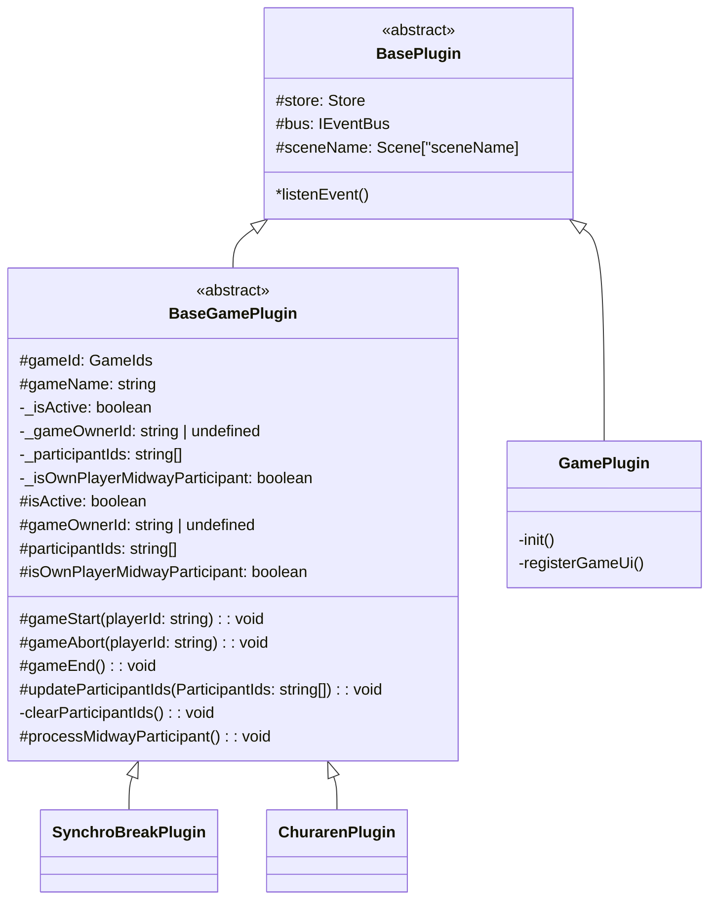

# ゲームプラグインのクラス図

このクラス図は、ゲームプラグインとそれを継承しているゲームの関係を示している。

```mermaid
classDiagram
    BasePlugin <|-- BaseGamePlugin
    BasePlugin <|-- GamePlugin
    BaseGamePlugin <|-- SynchroBreakPlugin
    BaseGamePlugin <|-- ChurarenPlugin

    class BasePlugin {
        <<abstract>>
        #store: Store<Scene>
        #bus: IEventBus<Scene>
        #sceneName: Scene["sceneName]

        *listenEvent()
    }

    class GamePlugin {
        -init()
        -registerGameUi()
    }

    class BaseGamePlugin {
        <<abstract>>
        #gameId: GameIds
        #gameName: string
        -_isActive: boolean
        -_gameOwnerId: string | undefined
        -_participantIds: string[]
        -_isOwnPlayerMidwayParticipant: boolean

        #isActive: boolean
        #gameOwnerId: string | undefined
        #participantIds: string[]
        #isOwnPlayerMidwayParticipant: boolean

        #gameStart(playerId: string): void
        #gameAbort(playerId: string): void
        #gameEnd(): void
        #updateParticipantIds(ParticipantIds: string[]): void
        -clearParticipantIds(): void
        #processMidwayParticipant(): void
    }

    class SynchroBreakPlugin {

    }

    class ChurarenPlugin {

    }
```
