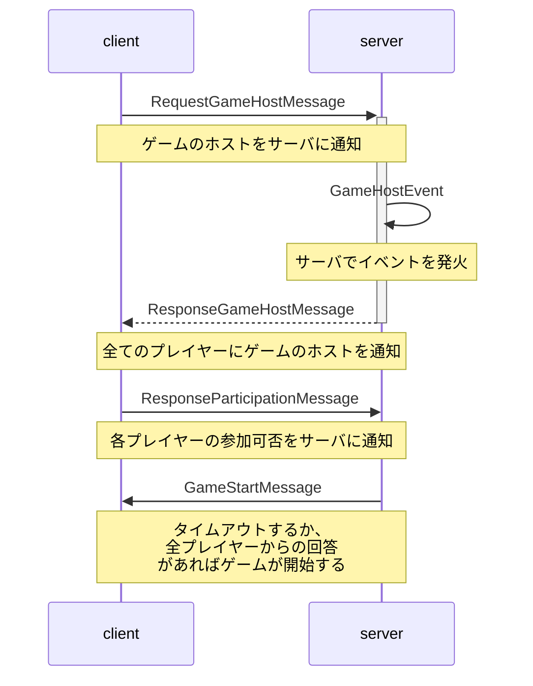
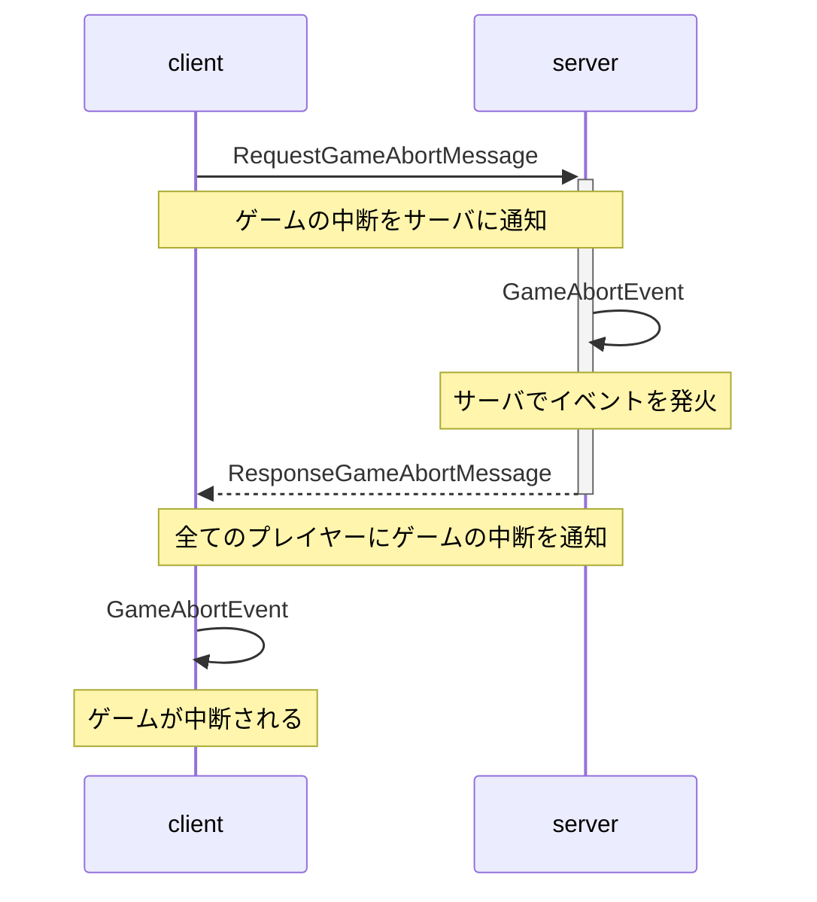
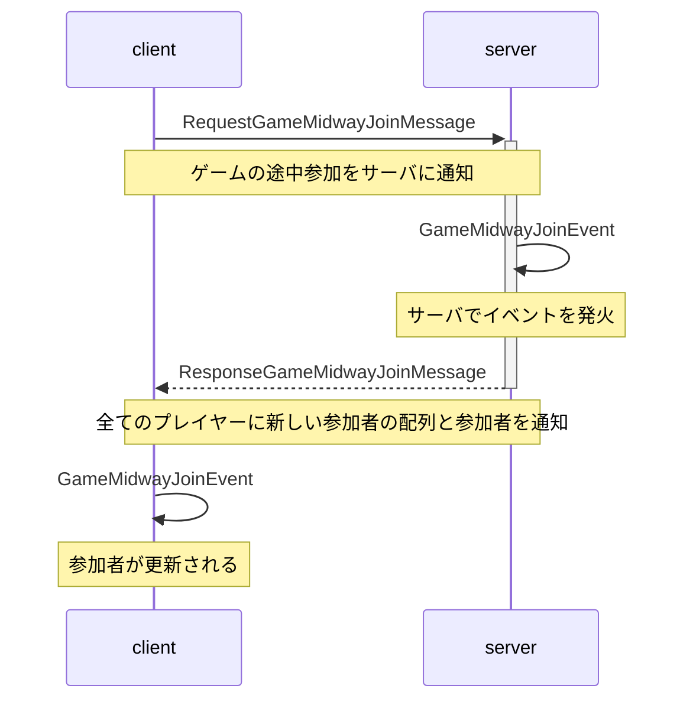
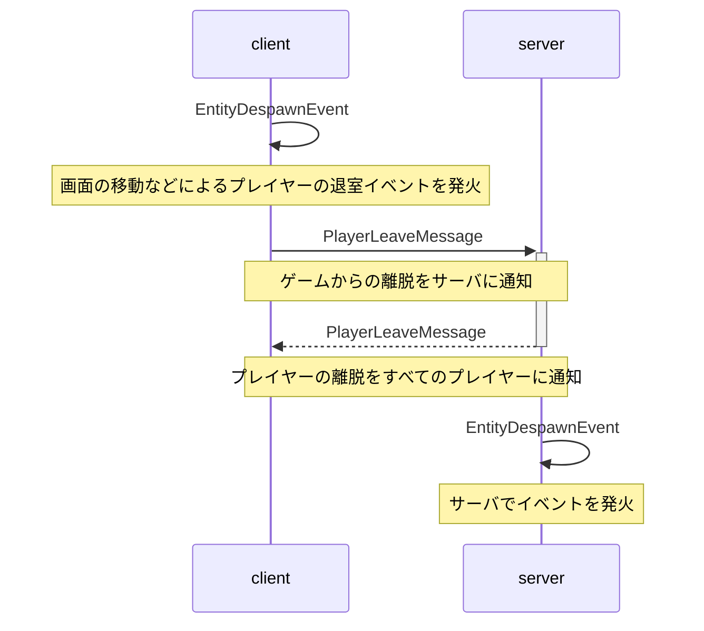
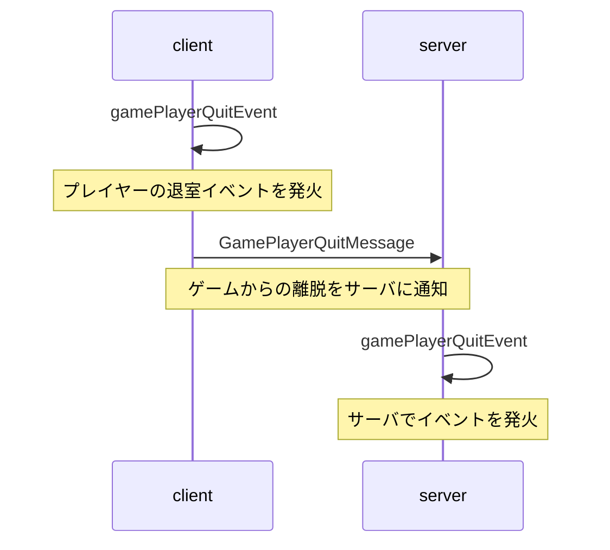

# ゲーム開始時のシーケンス図

以下のシーケンス図は、ゲームが開始される際のクライアントとサーバー間の通信フローを示している。

# ゲーム中断時のシーケンス図

以下のシーケンス図は、ゲームが中断される際のクライアントとサーバー間の通信フローを示している。

# ゲーム途中参加時のシーケンス図

以下のシーケンス図は、各ゲームが途中参加を許容している場合の「途中参加」ボタンを押下した際の通信フローを示している。

# ゲーム途中退室時のシーケンス図

以下のシーケンス図は、ゲーム途中退室時の2パターンの通信フローを示している。

### ちゅらバースから退室した場合

### ミニゲームから退室した場合
`gamePlayerQuitEvent`は、プレイヤー側で結果表示ウィンドウを閉じる操作が行われたことを通知するためのイベントである。

現在このイベントは、最終結果ウィンドウを閉じたプレイヤーをゲームから退室したと見なすために使用されている。

そのため、ミニゲームからの途中退室の他のクライアントへの通知等の処理は未対応である。

