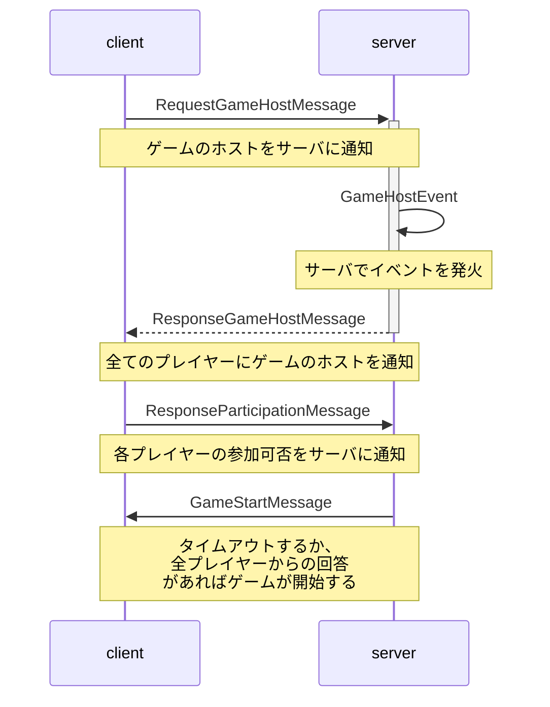
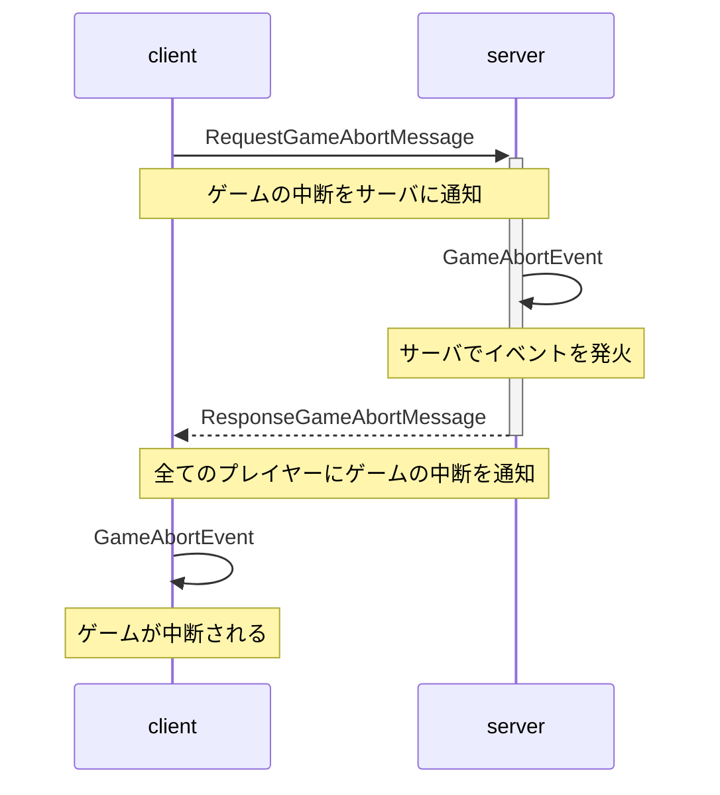

# ゲーム開始時のシーケンス図

以下のシーケンス図は、ゲームが開始される際のクライアントとサーバー間の通信フローを示している。

```mermaid
sequenceDiagram
    client ->>+ server: RequestGameHostMessage
    Note over client, server: ゲームのホストをサーバに通知

    server ->> server: GameHostEvent
    Note over server,server: サーバでイベントを発火

    server -->>- client: ResponseGameHostMessage
    Note over server,client: 全てのプレイヤーにゲームのホストを通知

    client ->> server: ResponseParticipationMessage
    Note over client, server: 各プレイヤーの参加可否をサーバに通知

    server ->> client: GameStartMessage
    Note over client, server: タイムアウトするか、<br> 全プレイヤーからの回答<br>があればゲームが開始する
```

# ゲーム中断時のシーケンス図

以下のシーケンス図は、ゲームが中断される際のクライアントとサーバー間の通信フローを示している。

```mermaid
sequenceDiagram
    client ->>+ server: RequestGameAbortMessage
    Note over client, server: ゲームの中断をサーバに通知

    server ->> server: GameAbortEvent
    Note over server,server: サーバでイベントを発火

    server -->>- client: ResponseGameAbortMessage
    Note over server,client: 全てのプレイヤーにゲームの中断を通知

    client ->> client: GameAbortEvent
    Note over client, client: ゲームが中断される
```
