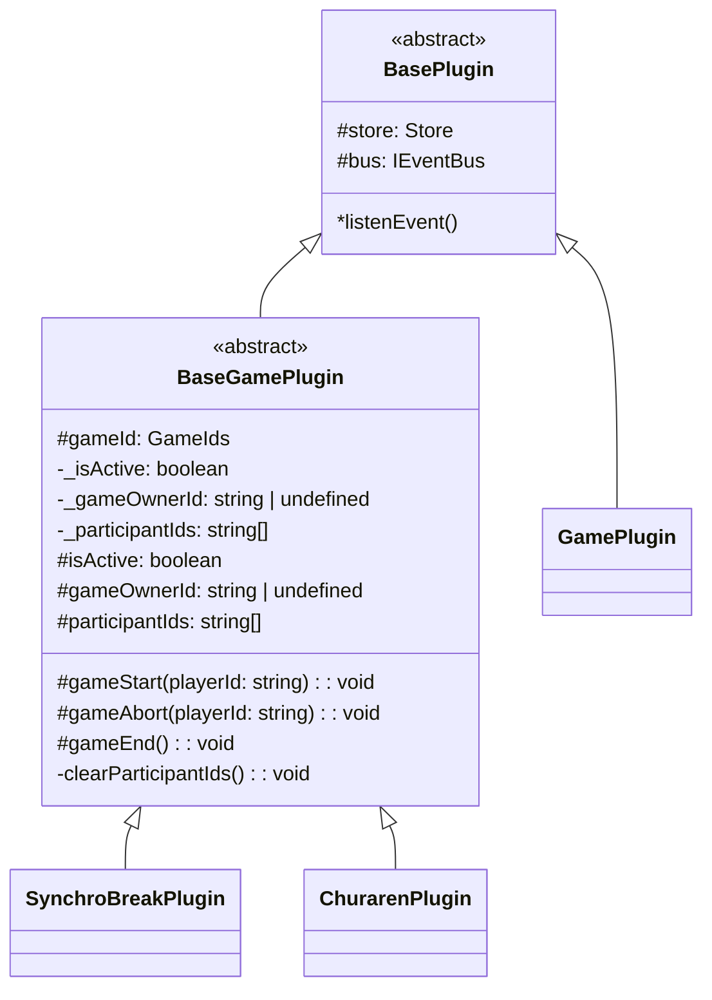

# ゲームプラグインのクラス図

このクラス図は、ゲームプラグインとそれを継承しているゲームの関係を示している。

```mermaid
classDiagram
    BasePlugin <|-- BaseGamePlugin
    BasePlugin <|-- GamePlugin
    BaseGamePlugin <|-- SynchroBreakPlugin
    BaseGamePlugin <|-- ChurarenPlugin

    class BasePlugin {
        <<abstract>>
        #store: Store<Scene>
        #bus: IEventBus<Scene>

        *listenEvent()
    }

    class GamePlugin {
    }

    class BaseGamePlugin {
        <<abstract>>
        #gameId: GameIds
        -_isActive: boolean
        -_gameOwnerId: string | undefined
        -_participantIds: string[]

        #isActive: boolean
        #gameOwnerId: string | undefined
        #participantIds: string[]

        #gameStart(playerId: string): void
        #gameAbort(playerId: string): void
        #gameEnd(): void
        -clearParticipantIds(): void
    }

    class SynchroBreakPlugin {

    }

    class ChurarenPlugin {

    }
```
