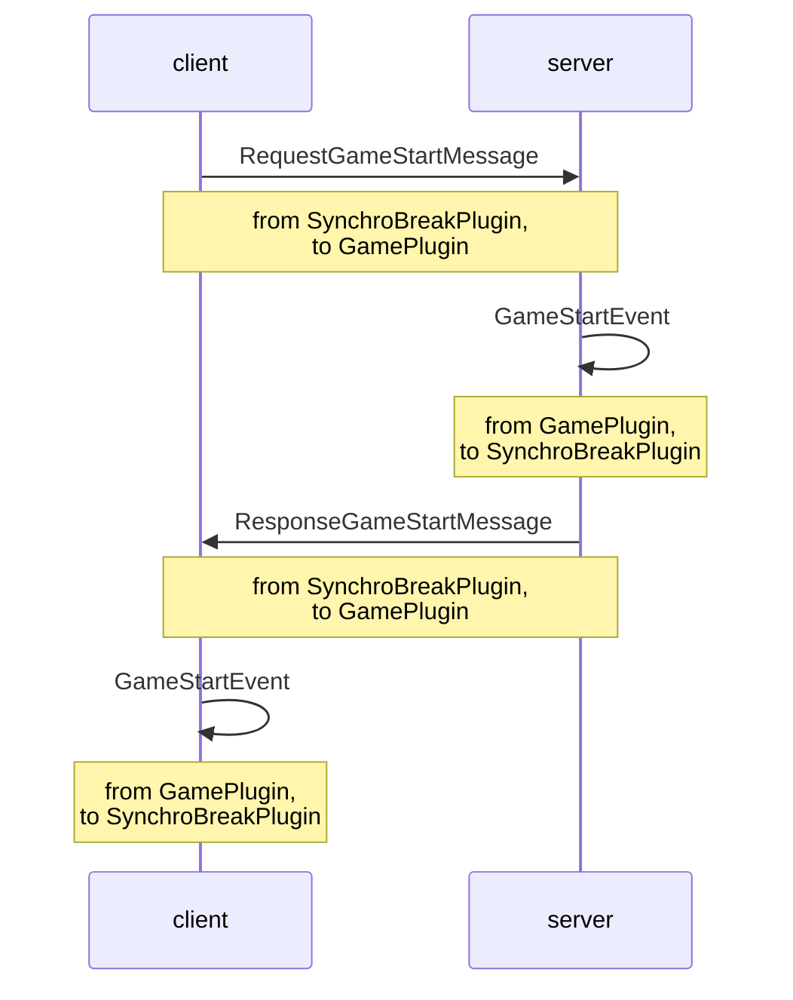

# ゲーム開始時のシーケンス図

このシーケンス図は、ゲームが開始される際のクライアントとサーバー間の通信フローを示している。
ゲームが中断される場合も同様のフローである。

具体例として、シンクロブレイクゲームを例に記述している。

```mermaid
sequenceDiagram
    client ->> server: RequestGameStartMessage
    Note over client, server: from SynchroBreakPlugin, <br> to GamePlugin

    server ->> server: GameStartEvent
    Note over server,server: from GamePlugin, <br> to SynchroBreakPlugin

    server ->> client: ResponseGameStartMessage
    Note over server,client: from SynchroBreakPlugin, <br>to GamePlugin


    client ->> client: GameStartEvent
    Note over client, client: from GamePlugin, <br> to SynchroBreakPlugin
```
